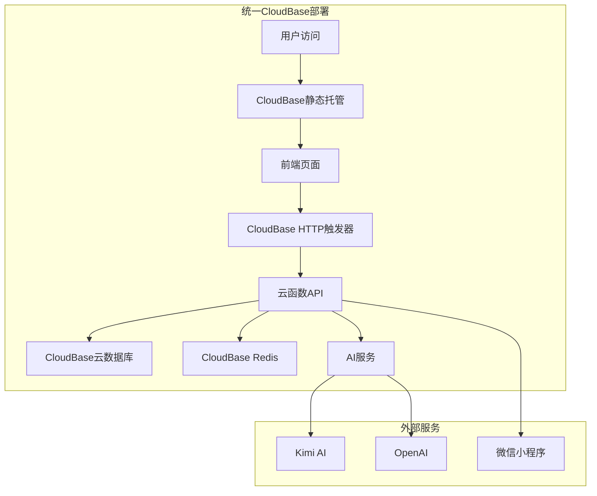

# 🎯 OfferCome系统统一部署方案

## 📋 当前状况分析

### 现有部署
1. **CloudBase部署** ✅ 正在运行
   - 环境ID: `offercome2025-9g14jitp22f4ddfc`
   - 访问地址: https://offercome2025-9g14jitp22f4ddfc-1256790827.tcloudbaseapp.com/
   - 状态: 正常运行

2. **其他部署方式** ⚠️ 需要整合
   - SVM服务器部署
   - Docker容器部署
   - 本地开发环境

## 🎯 统一部署方案

### 阶段1: 环境整合 (1-2天)

#### 1.1 数据库统一
```bash
# 将所有数据迁移到CloudBase云数据库
# MongoDB数据迁移
mongodump --uri="mongodb://localhost:27017/offercome" --out=./backup
mongorestore --uri="mongodb://cloudbase-mongo-uri" ./backup

# Redis数据迁移
redis-cli --rdb dump.rdb
# 导入到CloudBase Redis
```

#### 1.2 API服务统一
```javascript
// 统一API配置
const API_CONFIG = {
  production: {
    baseUrl: 'https://offercome2025-9g14jitp22f4ddfc-1256790827.ap-shanghai.app.tcloudbase.com/api-v2',
    envId: 'offercome2025-9g14jitp22f4ddfc'
  },
  development: {
    baseUrl: 'http://localhost:3000/api',
    envId: 'offercome2025-9g14jitp22f4ddfc'
  }
};
```

### 阶段2: 前端统一 (1天)

#### 2.1 静态资源整合
```bash
# 将所有前端资源部署到CloudBase静态托管
tcb hosting deploy public/ -e offercome2025-9g14jitp22f4ddfc

# 统一访问地址
# 主站: https://offercome2025-9g14jitp22f4ddfc-1256790827.tcloudbaseapp.com/
# API: https://offercome2025-9g14jitp22f4ddfc-1256790827.ap-shanghai.app.tcloudbase.com/api-v2
```

#### 2.2 小程序配置统一
```javascript
// miniprogram/app.js
const config = {
  apiBaseUrl: 'https://offercome2025-9g14jitp22f4ddfc-1256790827.ap-shanghai.app.tcloudbase.com/api-v2',
  envId: 'offercome2025-9g14jitp22f4ddfc'
};
```

### 阶段3: 服务整合 (2-3天)

#### 3.1 RAG系统整合
```javascript
// 统一RAG服务配置
const RAG_CONFIG = {
  cloudbase: {
    database: 'mongodb://cloudbase-mongo-uri',
    redis: 'redis://cloudbase-redis-uri',
    storage: 'cloudbase-storage'
  }
};
```

#### 3.2 AI服务整合
```javascript
// 统一AI服务调用
const AI_SERVICES = {
  primary: 'kimi', // 主要服务
  fallback: 'openai', // 备用服务
  test: 'simulated' // 测试服务
};
```

## 🔧 实施步骤

### 步骤1: 备份现有数据
```bash
# 创建完整备份
./backup-all-data.sh

# 备份包含：
# - MongoDB数据
# - Redis缓存
# - 上传文件
# - 配置文件
```

### 步骤2: 更新环境配置
```bash
# 更新.env文件
cat > .env.cloudbase << EOF
# CloudBase统一配置
CLOUDBASE_ENV_ID=offercome2025-9g14jitp22f4ddfc
NODE_ENV=production

# 数据库配置
MONGODB_URI=mongodb://cloudbase-mongo-uri
REDIS_URL=redis://cloudbase-redis-uri

# AI服务配置
KIMI_API_KEY=your_kimi_key
OPENAI_API_KEY=your_openai_key

# 其他配置...
EOF
```

### 步骤3: 部署到CloudBase
```bash
# 部署云函数
tcb fn deploy api -e offercome2025-9g14jitp22f4ddfc

# 部署静态资源
tcb hosting deploy public/ -e offercome2025-9g14jitp22f4ddfc

# 配置HTTP触发器
tcb service:create -e offercome2025-9g14jitp22f4ddfc -p api
```

### 步骤4: 测试验证
```bash
# 运行完整测试
./test-unified-deployment.sh

# 测试项目：
# - API接口测试
# - 数据库连接测试
# - RAG系统测试
# - AI服务测试
# - 前端功能测试
```

## 📊 统一后的架构



## 🎯 优势分析

### 1. 统一管理
- ✅ 单一部署环境
- ✅ 统一监控和日志
- ✅ 简化维护工作

### 2. 成本优化
- ✅ 按需付费
- ✅ 自动扩缩容
- ✅ 减少服务器成本

### 3. 高可用性
- ✅ 腾讯云基础设施
- ✅ 自动备份
- ✅ 故障自动恢复

### 4. 开发效率
- ✅ 统一开发环境
- ✅ 简化部署流程
- ✅ 快速迭代

## ⚠️ 注意事项

### 1. 数据迁移
- 确保数据完整性
- 测试迁移后的功能
- 保留原始备份

### 2. 服务中断
- 选择低峰期进行迁移
- 准备回滚方案
- 通知用户维护时间

### 3. 配置更新
- 更新所有环境变量
- 检查API密钥配置
- 验证第三方服务集成

## 🚀 执行时间表

| 阶段 | 任务 | 时间 | 负责人 |
|------|------|------|--------|
| 第1天 | 数据备份和环境准备 | 4小时 | 开发团队 |
| 第2天 | 服务迁移和配置 | 6小时 | 开发团队 |
| 第3天 | 测试和验证 | 4小时 | 测试团队 |
| 第4天 | 上线和监控 | 2小时 | 运维团队 |

## 📞 联系信息

- **技术支持**: 开发团队
- **紧急联系**: 运维团队
- **用户通知**: 客服团队

---

**总结**: 通过统一到CloudBase部署，可以解决当前的冲突问题，提高系统的稳定性和可维护性。 