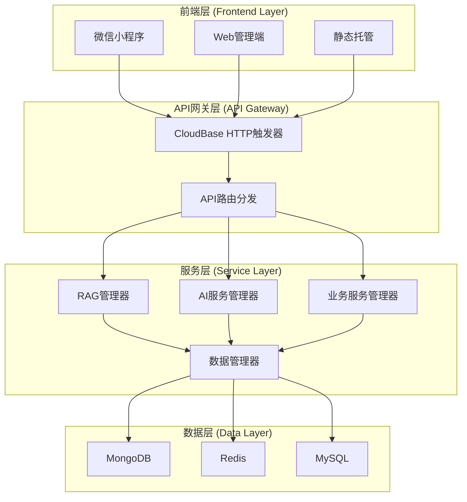
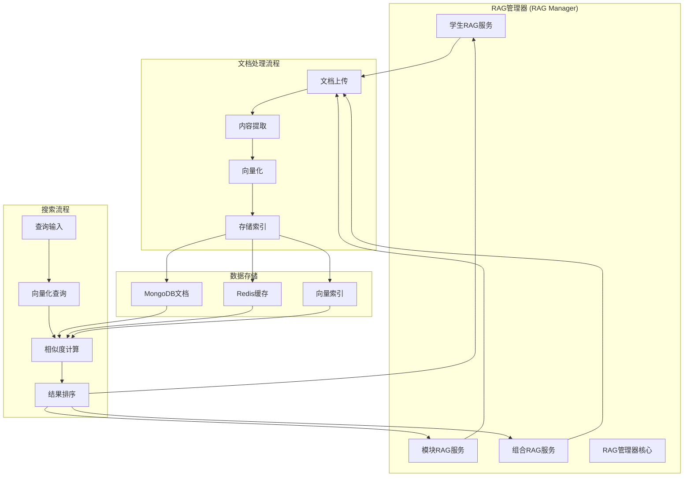
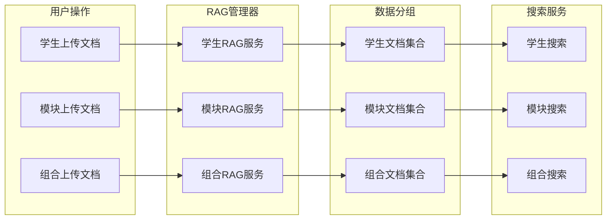
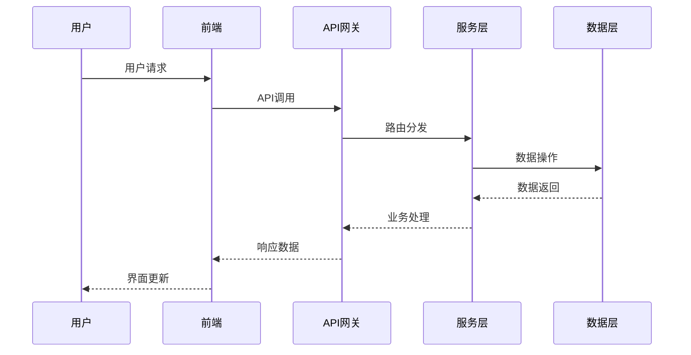
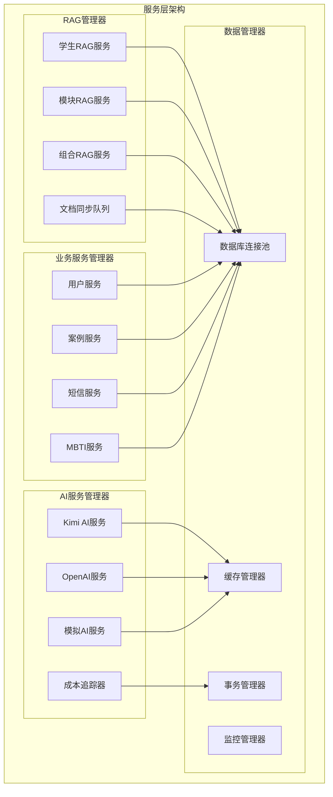
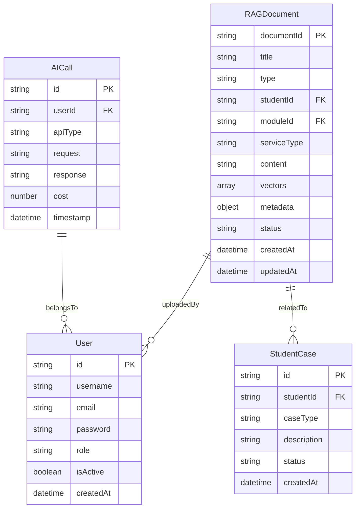
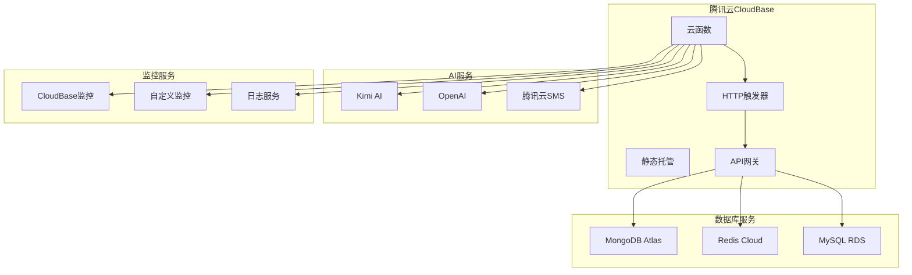
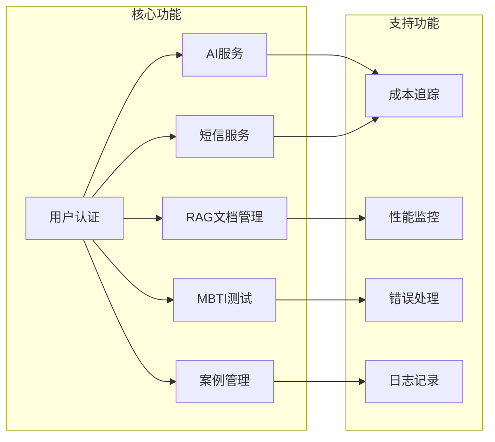
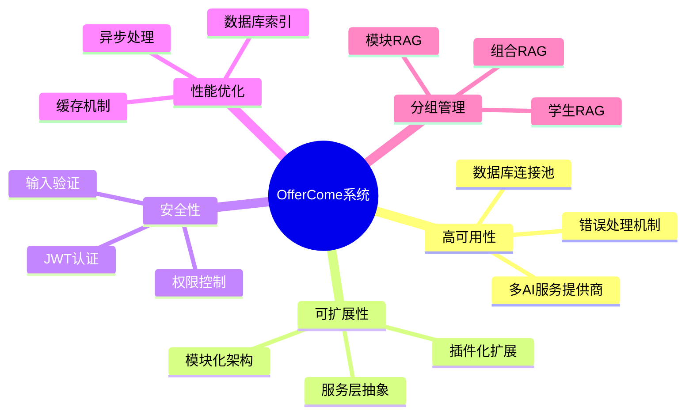

# 🏗️ OfferCome智能求职辅导平台 - Mermaid架构图

## 📋 系统概述

OfferCome是一个基于腾讯云CloudBase的智能求职辅导平台，采用现代化的微服务架构，支持按学生和模块分组的RAG文档管理。

## 🎯 整体系统架构

## 🔄 RAG系统详细架构

## 🎯 分组RAG架构

## 🔄 数据流程图

## 🏛️ 服务层详细架构

## 📊 数据库关系图

## 🔧 部署架构

## 🎯 核心功能模块关系

## 📈 系统特点总结

## 🎉 架构优势

1. **分层清晰**：前端、API、服务、数据四层架构
2. **模块化设计**：每个功能模块独立，易于维护和扩展
3. **高可用性**：多服务提供商备份，完善的错误处理
4. **灵活分组**：支持按学生、模块、组合的精确分组
5. **现代化技术栈**：CloudBase + Node.js + MongoDB + Redis
6. **完整监控**：性能监控、错误追踪、成本控制

这个Mermaid架构图清晰地展示了OfferCome系统的整体架构、数据流程和组件关系，为系统的开发和维护提供了直观的指导。 